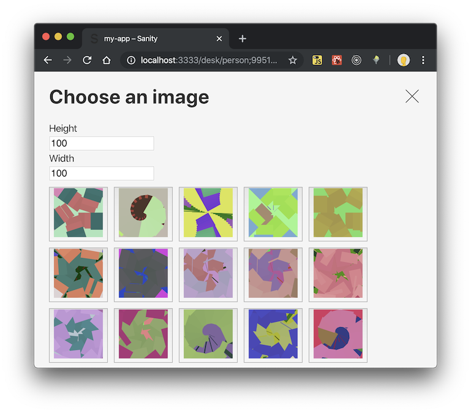

# Fiona Placeholder (Asset Source)

Usual installation for sanity plugin

- `npm install sanity-plugin-asset-source-fiona-placeholder`
- add the plugin name`"asset-source-fiona-placeholder"` to `sanity.json` `plugins` array.

Then you should be able to use in your model as follows...

... in your schema file, import ther plugin

    import FionaPlaceholder from "sanity-plugin-asset-source-fiona-placeholder";

... in your schema define the FionaPlaceholder as an image source
    
    {
      name: "name",
      type: "image",
      options: {
        sources: [FionaPlaceholder]
      }
    }

Now when you go to select an image, it should present you with a buffet of brightly coloured placeholder images.

The images are gerated as SVG images that are then base64 encoded as a url. The image generation is done by Fiona - your friendly pseudo random data generating library: https://fiona.now.sh/examples/image-placeholders/